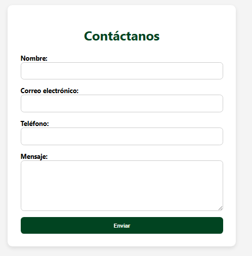

## 📄 `README.md`

# 📬 Formulario de Contacto con Validación en Tiempo Real

Este mini proyecto consiste en un formulario de contacto desarrollado con **HTML, CSS y JavaScript puro**, con validación **en tiempo real** y validación final antes del envío.

---

## 🎯 Objetivo

Ofrecer un formulario profesional y funcional para ser integrado en sitios web corporativos, especialmente en sectores como **cosmética, perfumería y cuidado personal**, respetando una estética limpia y elegante.

---

## 🧩 Características

- ✅ Validación en tiempo real (mientras se escribe)
- ✅ Validación final antes de envío
- ✅ Estilo profesional con colores corporativos: verde oscuro y blanco
- ✅ Diseño responsive y minimalista
- ✅ Mensajes de error amigables y específicos
- ✅ Semántica HTML correcta y uso de `input`, `textarea`, `label`

---

## 🖼 Captura de pantalla



## 💻 Tecnologías utilizadas

- HTML5
- CSS3 (con variables y diseño responsivo)
- JavaScript ES6+

---

## 📁 Estructura del proyecto

```

formulario-contacto/
├── index.html      # Estructura HTML
├── style.css       # Estilos personalizados
└── script.js       # Lógica de validación

````

---

## 📦 Cómo usar

1. Clona el repositorio:

```bash
git clone https://github.com/TU_USUARIO/formulario-contacto-validado.git
````

2. Abre `index.html` en tu navegador
3. Prueba la validación escribiendo datos incorrectos o incompletos
4. Completa correctamente todos los campos y haz clic en **"Enviar"**

---

## 🔒 Validaciones implementadas

| Campo    | Reglas                                              |
| -------- | --------------------------------------------------- |
| Nombre   | Obligatorio, solo letras y espacios                 |
| Correo   | Obligatorio, formato válido (`usuario@dominio.com`) |
| Teléfono | Opcional, pero debe tener exactamente 10 dígitos    |
| Mensaje  | Obligatorio, mínimo 10 caracteres                   |

---

## 🧠 Autor

Jefferson Anaya
[GitHub](https://github.com/jefryerson2003)
